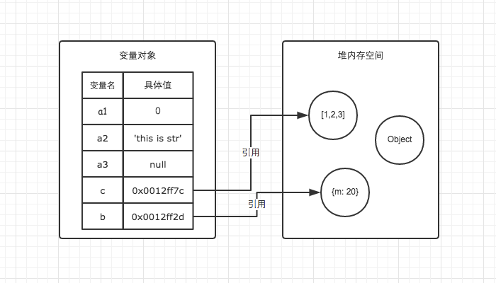

# 类型

[TOC]

## 拥有的类型

`ECMAScript6` 标准定义了 7 种数据类型:

* 6 种原始类型
  * Null（空）
  * Undefined（未定义）
  * Number（数字）
  * String（字符串）
  * Boolean（布尔）
  * Symbol（ECMAScript 6 新定义）
* Object

## 原始类型

原始类型在`ECMAScript`中被定义为 `primitive values`，表示值本身不可改变，原始类型在存储的时候是直接存储的值。

下面的例子中，变量 `a` 被修改了，从原来的`string`变成了`stringstring2`

```js
let a = "string";
a += "string2";
```

因为原始类型值不可变，所以变量`a`中存储的值并不是在原有的字符串上进行修改，而是有`string` + `string2`两个原始值计算之后得到的新的字符串，我们可以通过如下的方式进行验证：

```js
let a = "string"
let b = a;
a += "123"

console.log(a) // string123
console.log(b) // string
```

## 引用类型

在 JS 中除了原始类型之外的其它类型都是引用类型，例如：Array、Function 等。引用类型值的大小是不固定的，值保存在堆内存中。

下面的例子能够帮助你更好的理解原始类型和引用类型存储的区别

> 从网络上摘录，感谢作者的无私分享，[原文地址](https://www.jianshu.com/p/996671d4dcc4)

```js
var a1 = 0;   // 变量对象
var a2 = 'this is str'; // 变量对象
var a3 = null; // 变量对象

var b = { m: 20 }; // 变量b存在于变量对象中，{m: 20} 作为对象存在于堆内存中
var c = [1, 2, 3]; // 变量c存在于变量对象中，[1, 2, 3] 作为对象存在于堆内存中
```




因此当我们要访问堆内存中的引用数据类型时，实际上我们首先是从变量对象中获取了该对象的地址引用（或者地址指针），然后再从堆内存中取得我们需要的数据。

让我们再看一个例子

```js
var m = { a: 10, b: 20 }
var n = m;
n.a = 15;

// 这时m.a的值是多少
```

我们通过`var n = m`执行一次复制引用类型的操作。引用类型的复制同样也会为新的变量自动分配一个新的值保存在变量对象中，但不同的是，这个新的值，仅仅只是引用类型的一个地址指针。当地址指针相同时，尽管他们相互独立，但是在变量对象中访问到的具体对象实际上是同一个。如图所示。

因此当我改变n时，m也发生了变化。这就是引用类型的特性。


## 类型判断

### typeof

`typeof`是 `JS` 中的一个操作符，用于判断变量的类型，例如：

```js
typeof 1 // number
typeof 'hello' // string
typeof true // boolean
...
```

`typeof`的结果是返回一个表示类型的字符串，返回值有且仅有以下几种：

| 类型                         | 结果                 |
| ---------------------------- | -------------------- |
| Undefined                    | `"undefined"`        |
| Null                         | `"object"`（见下文） |
| Boolean                      | `"boolean"`          |
| Number                       | `"number"`           |
| String                       | `"string"`           |
| Symbol （ECMAScript 6 新增） | `"symbol"`           |
| 函数对象                     | `"function"`         |
| 任何其他对象                 | `"object"`           |

这里不得不提的是 `typeof null === 'object'`这种情况了。

在 JavaScript 最初的实现中，JavaScript 中的值是由一个表示类型的标签和实际数据值表示的。对象的类型标签是 0。由于 `null` 代表的是空指针（大多数平台下值为 0x00），因此，null的类型标签也成为了 0，`typeof null`就错误的返回了"`object"`。

ECMAScript提出了一个修复（通过opt-in），但[被拒绝](http://wiki.ecmascript.org/doku.php?id=harmony:typeof_null)。这将导致typeof null === 'null'。

### instanceof

### Object.prototype.toString.call

## 参考

* [前端基础进阶（一）：内存空间详细图解](https://www.jianshu.com/p/996671d4dcc4)